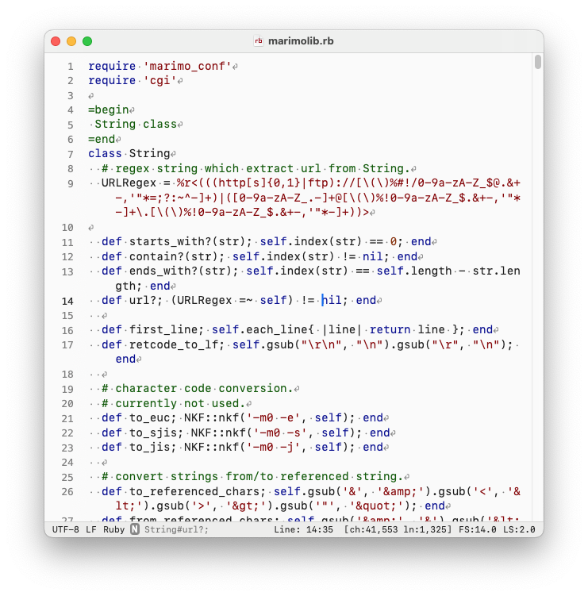

# Ganpi

**For You. Not for Everyone.** 
**No nags. No noise. Just text.**

Ganpi is a macOS-native text editor built for one thing: making text do exactly what you intend.

No wizards. No hand-holding. No “smart” guesses getting between you and the page. Ganpi keeps the UI quiet, the editing predictable, and the response immediate—so you stay in control and in flow.

Built in Swift with a custom editing core for precise control over text handling, behavior, and performance.

If you want an editor that puts editing first and everything else second, welcome.

## Overview

Ganpi is a keyboard-first, deeply customizable plain-text editor for macOS.

Ganpi is designed around reconfigurable editing behavior. Key bindings are not just assignable—they are composable. You can bind arbitrary keystroke sequences to built-in actions, string insertion, file insertion, tag insertion, or external script execution, and combine them into a single workflow. The same action sequences can also be assigned to custom menu items with user-defined names and shortcuts.

Ganpi also provides several distinctive editing features: **Grid Jump**, which moves the caret anywhere visible on screen with two keystrokes; **Yank Pop**, which lets you cycle backward through clipboard history; **Bracket Pair Selection**, which repeatedly selects the inside or outside of matching brackets; and **ExCommand**, which enables direct search, replace, and line extraction without opening the standard search panel.

Alongside these, Ganpi includes the core capabilities expected of a modern plain-text editor: automatic detection of text encoding, line endings, and document type; unlimited undo/redo; syntax coloring and outline menus for supported languages; and word completion.

**Supported macOS:** 14+ (Sonoma)
**Web Site:** https://drycarbon.com/ganpi/index.html

Ganpi is a macOS-only application written in Swift. It is structured as a Cocoa document-based application, but uses custom TextView and TextStorage components designed specifically for text editing.

## License

Released under the MIT License.

This means you are free to use, modify, and redistribute the software under the terms of the license.
